本教程仅供学习交流，请支持正版Navicat，官网地址：www.navicat.com.cn
[点击官网下载Navicat12.1](http://www.navicat.com.cn/download/navicat-premium)
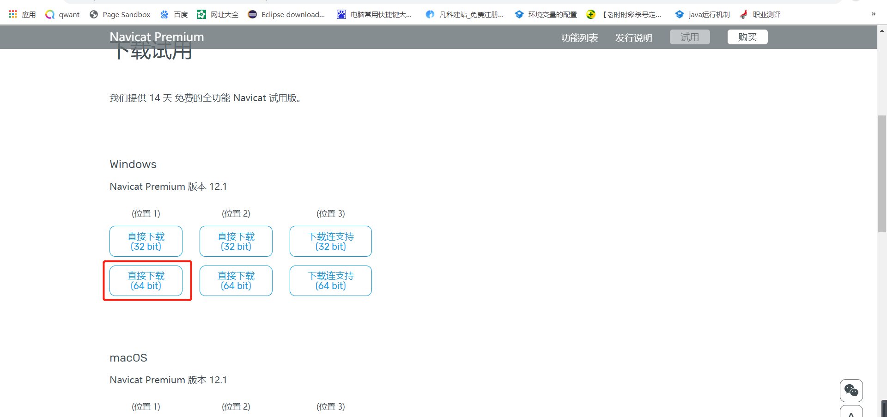

下载好之后，默认下一步进行安装
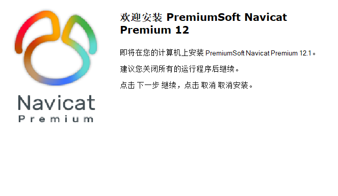

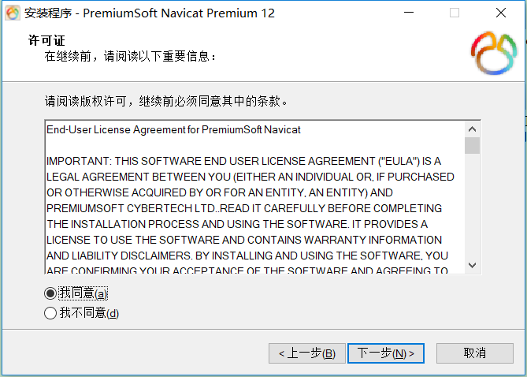

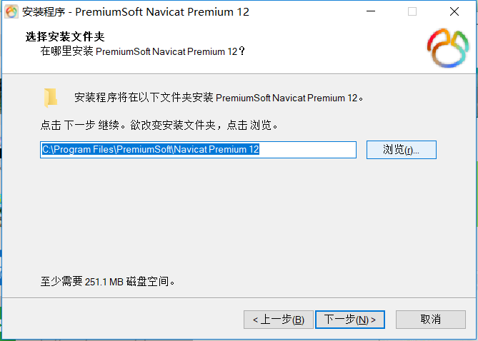

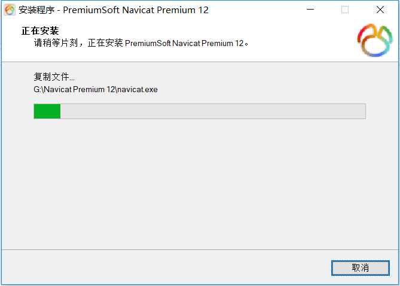

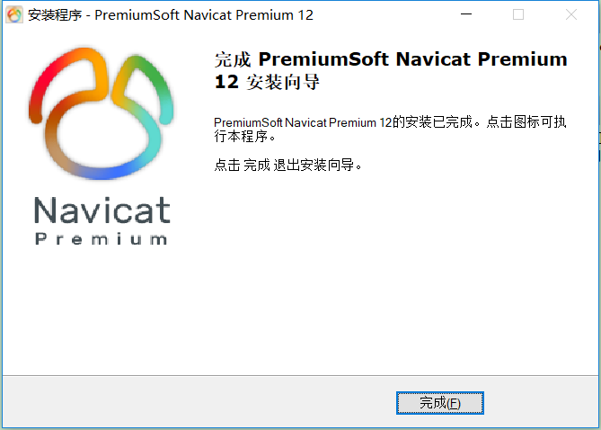

破解软件地址：
[点击下载](https://github.com/st-xsy/Software-Resource)
**提示：要想使用破解软件必须先把电脑杀毒软件关闭。**

下载好后解压，然后点击安装

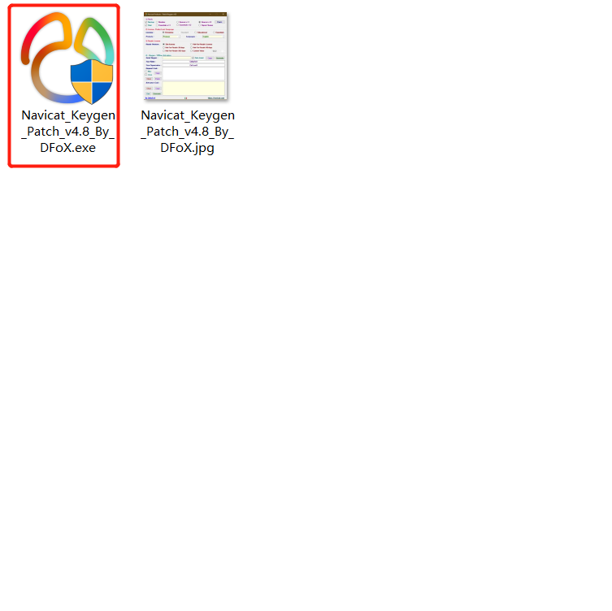

**点击图中右上角patch，只能patch一次，所以小心，之前要知道自己安装的目录在哪里，如果不小心失误，就重新卸载了在装**

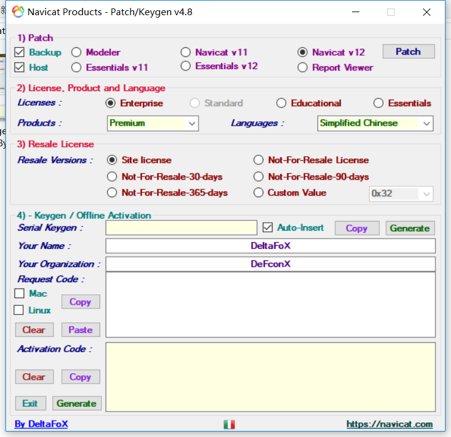

选中自己安装目录中的exe

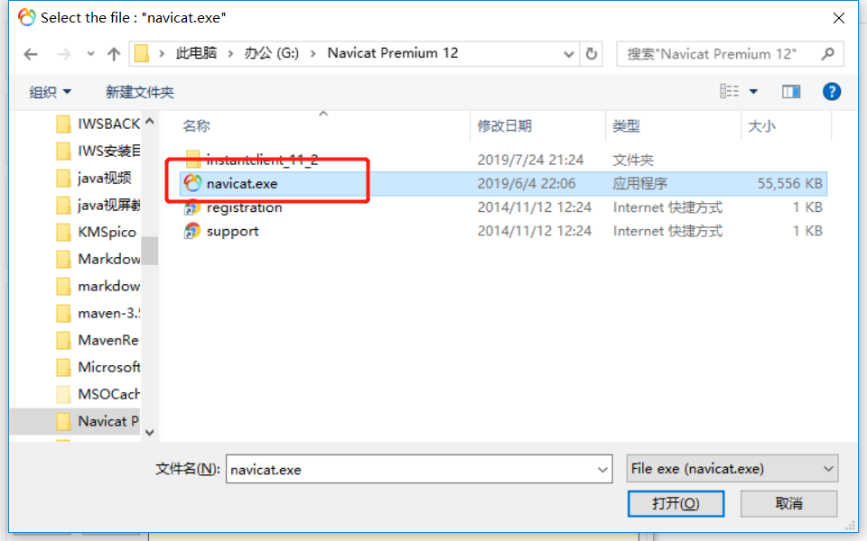

会显示如图所示

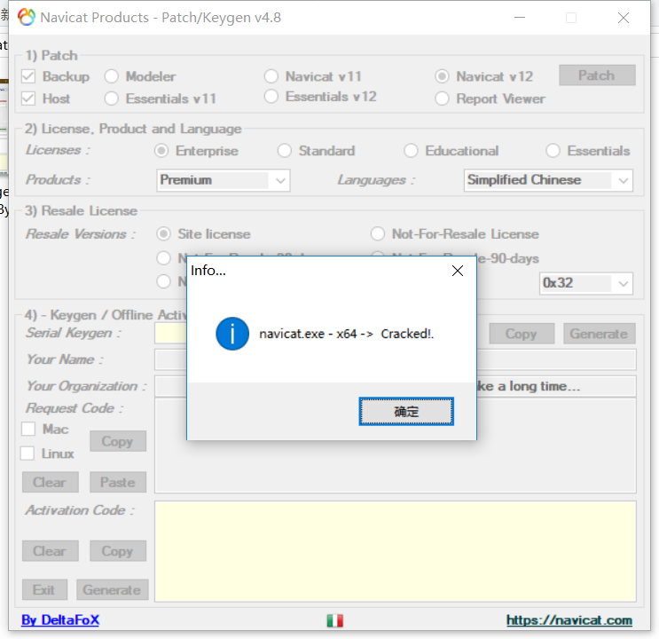

之后打开软件，点击注册

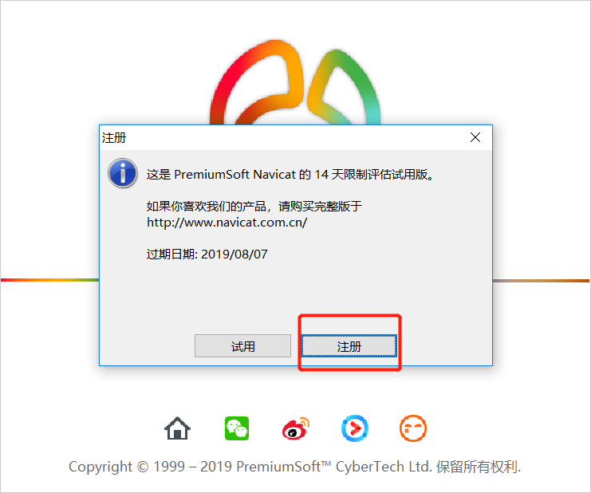

然后在激活软件中点击图中所示

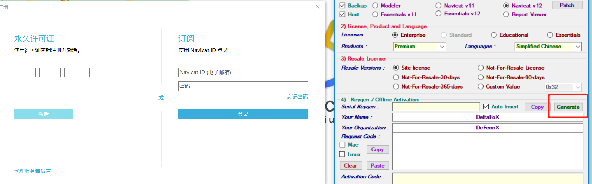

左边秘钥默认会填上，没有就手动

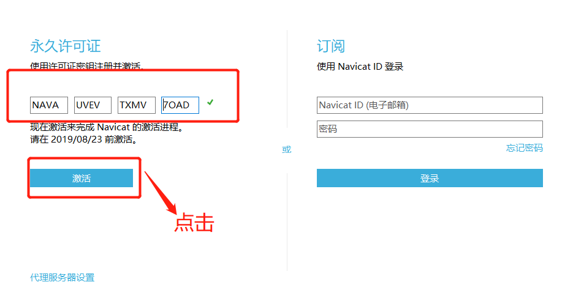

点击手动激活

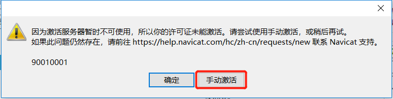

然后把左边生成的秘钥复制到破解软件中

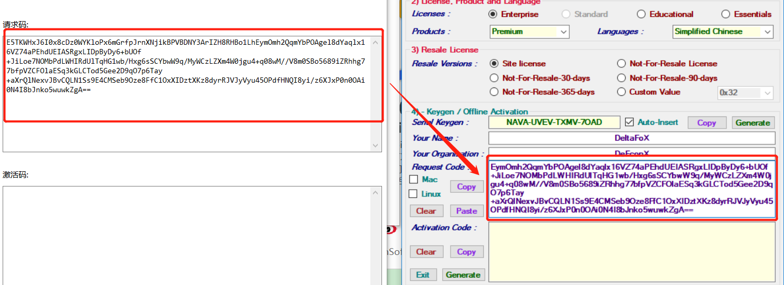

点击左下角红色框位置，会生成相应秘钥

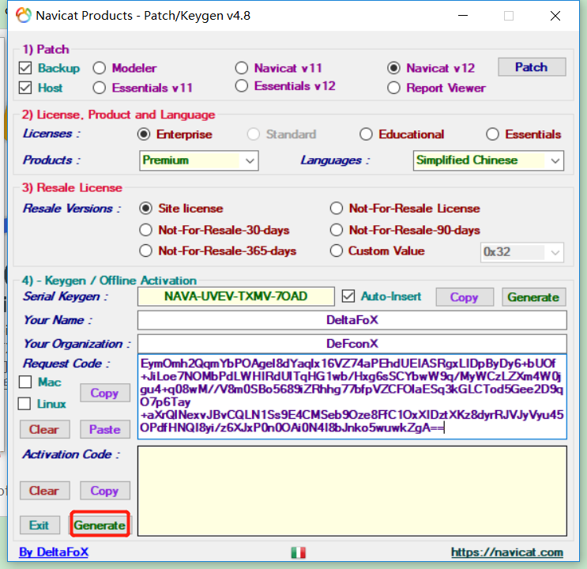

粘贴到激活码中，点击激活

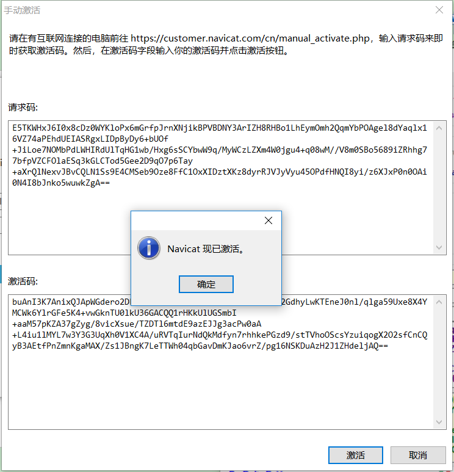

永久激活成功，如下图

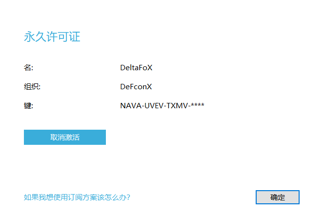

